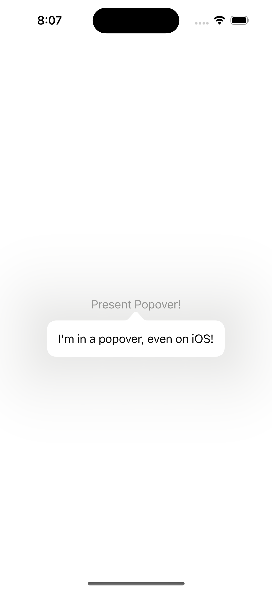

# AlwaysPopover

SwiftUI's `.popover` will perform a sheet presentation on iOS but use the expected popover presentation on iPadOS.

I needed the expected popover on iOS. Influenced by [this great blog post](https://pspdfkit.com/blog/2022/presenting-popovers-on-iphone-with-swiftui/).

## Usage

Identical to SwiftUI's `.popover`:

```swift
import AlwaysPopover
import SwiftUI

struct ContentView: View {
    
    @State
    private var presentPopover: Bool = false
    
    var body: some View {
		Button {
			presentPopover = true
		} label: {
			Text("Present Popover!")
		}
		.alwaysPopover(isPresented: $presentPopover) {
			Text("I'm in a popover, even on iOS!")
				.padding()
		}
	}
}
```

<details>
<summary>Result</summary>

</details>

The popover is dismissed by:
  - tapping outside the popover
  - setting the presentation binding to `false`
  - calling the native SwitUI `dismiss` environment action